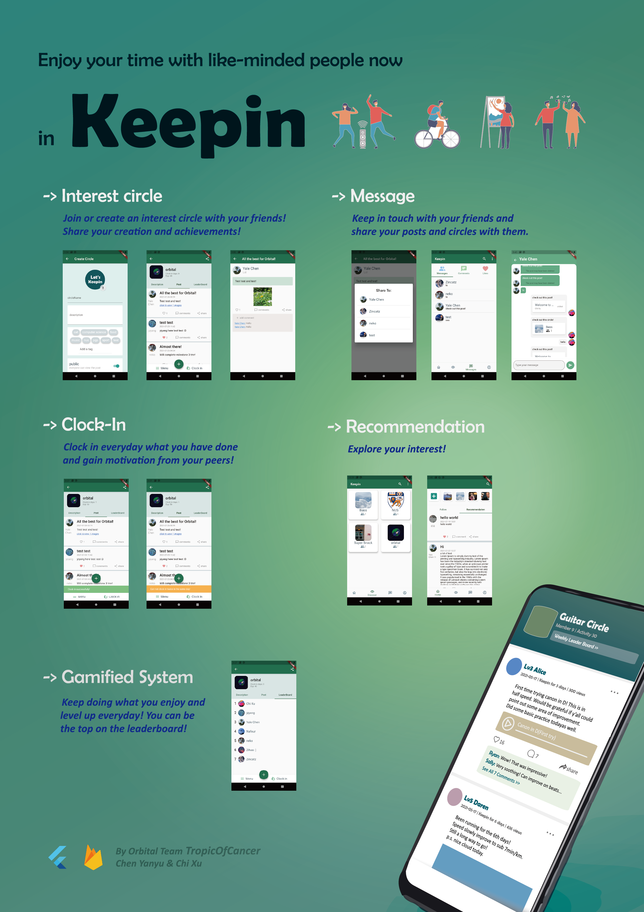

# keepin

A mobile platform for people to clock in in their interest circle whenever they join an event, have done their practice or have something interesting to share.

## Getting Started

Download the apk file [here](https://github.com/tsiyuk/keepin/releases/tag/v1.0) and install it on your mobile phone.

## Document
You can check our document [here](https://docs.google.com/document/d/182Fx9l9qHtbZgNM7j6ezTNkhG4Ne_1fg7Fsdnqadfc0/edit?usp=sharing)
You can check our demo video [here](https://drive.google.com/file/d/1I1xui7DXc8iEAuBNOdlKJBXN6DnLhPzN/view?usp=sharing)